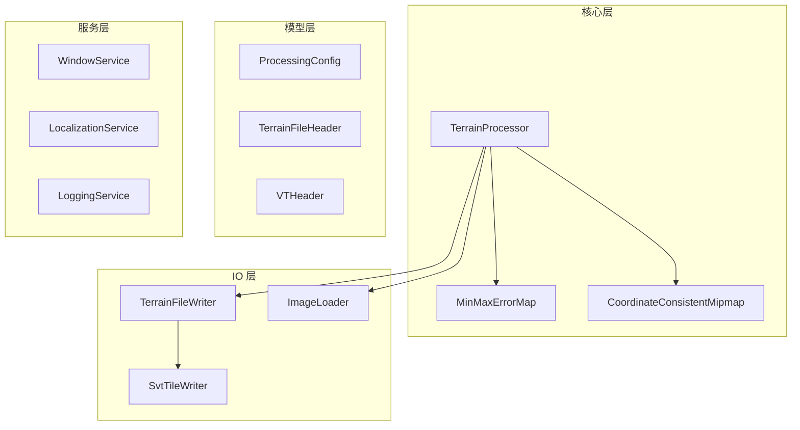

# TerrainPreProcessor 代码审查报告

## 概述

本报告对 TerrainPreProcessor 项目进行全面的代码审查，涵盖逻辑错误、安全漏洞、性能瓶颈、代码规范问题，并提供优化建议和重构方案。

---

## 1. MinMaxErrorMap.cs 分析

### 1.1 逻辑错误

#### 问题 1: 公有字段的封装问题
```csharp
public float[] _data;  // 使用下划线前缀但声明为 public
public int Width;
public int Height;
```
**问题**: `_data` 使用下划线前缀通常表示私有字段，但声明为 `public`，违反命名约定。直接暴露字段破坏了封装性。

**建议**: 使用属性封装：
```csharp
private float[] _data;
public int Width { get; }
public int Height { get; }
public ReadOnlySpan<float> Data => _data.AsSpan();
```

#### 问题 2: 潜在的数组越界风险
在 [`Generate()`](Models/MinMaxErrorMap.cs:37) 方法中：
```csharp
maps[0] = new MinMaxErrorMap(baseDimX, baseDimY);
// ...
int index = xChunkIndex + yChunkIndex * chunkX;
maps[0]._data[index * 3] = minHeight;
```
**问题**: `chunkX` 和 `baseDimX` 计算方式相同，但如果 `chunkX` 与 `baseDimX` 不一致，可能导致数组越界。

**建议**: 添加边界检查或使用一致的变量名。

#### 问题 3: 进度报告不准确
```csharp
progress?.Report((10 + (i * 80 / lodLevelCount), 100, ...));
```
**问题**: 进度百分比计算在 `lodLevelCount` 为 0 时会导致除零错误（虽然不太可能发生）。

### 1.2 性能问题

#### 问题 1: 重复计算
在 [`GetAreaMinMaxHeight()`](Models/MinMaxErrorMap.cs:167) 中：
```csharp
int clampedY = Math.Clamp(y, 0, mapH - 1);
int clampedX = Math.Clamp(x, 0, mapW - 1);
```
**问题**: 每个像素都进行 clamp 操作，即使坐标已经在有效范围内。

**建议**: 在调用前验证边界，或使用分支预测优化：
```csharp
// 在循环外部处理边界情况
if (startX >= 0 && startY >= 0 && endX < mapW && endY < mapH)
{
    // 快速路径：无需 clamp
}
else
{
    // 慢速路径：需要 clamp
}
```

#### 问题 2: 内存分配
```csharp
_data = new float[dimX * dimY * 3];
```
**问题**: 对于大地形图，这可能导致大量内存分配。考虑使用 `ArrayPool<float>` 或内存映射文件。

#### 问题 3: 并行效率
```csharp
Parallel.For(0, chunkY, yChunkIndex => { ... });
```
**问题**: 内部循环是串行的，可能导致负载不均衡。

**建议**: 使用 `Parallel.ForEach` 或 `Parallel.For` 对所有 chunk 进行并行处理：
```csharp
var options = new ParallelOptions { MaxDegreeOfParallelism = Environment.ProcessorCount };
Parallel.For(0, chunkY * chunkX, options, index => {
    int yChunkIndex = index / chunkX;
    int xChunkIndex = index % chunkX;
    // ...
});
```

### 1.3 安全问题

#### 问题 1: 文件路径未验证
```csharp
Image<L16> heightMapImage = Image.Load<L16>(inputPath);
```
**问题**: 未验证文件是否存在、文件格式是否正确、文件大小是否合理。

**建议**: 添加输入验证：
```csharp
if (!File.Exists(inputPath))
    throw new FileNotFoundException("高度图文件不存在", inputPath);

var fileInfo = new FileInfo(inputPath);
if (fileInfo.Length > MaxFileSize)
    throw new ArgumentException("高度图文件过大");
```

#### 问题 2: 二进制读取缺乏验证
在 [`ReadFrom()`](Models/MinMaxErrorMap.cs:270) 中：
```csharp
int width = reader.ReadInt32();
int height = reader.ReadInt32();
var map = new MinMaxErrorMap(width, height);
```
**问题**: 未验证 `width` 和 `height` 的合理性，可能导致内存耗尽攻击。

**建议**: 添加边界检查：
```csharp
const int MaxDimension = 65536;
if (width <= 0 || height <= 0 || width > MaxDimension || height > MaxDimension)
    throw new InvalidDataException($"无效的尺寸: {width}x{height}");
```

---

## 2. TerrainProcessor.cs 分析

### 2.1 逻辑错误

#### 问题 1: 资源泄漏风险
```csharp
var heightMap = Image.Load<L16>(config.HeightMapPath!);
// ... 多个操作 ...
heightMap.Dispose();
splatMap?.Dispose();
```
**问题**: 如果在 `Dispose()` 之前发生异常，资源不会被释放。

**建议**: 使用 `using` 语句：
```csharp
using var heightMap = Image.Load<L16>(config.HeightMapPath!);
// 或使用 try-finally
```

#### 问题 2: 静态字段线程安全问题
```csharp
private static int _processedTilesCount = 0;
// ...
_processedTilesCount++;
```
**问题**: 静态字段在多线程环境下不安全，且多次调用会累积。

**建议**: 使用局部变量或 `Interlocked.Increment`：
```csharp
int processedTilesCount = 0;
// 或
Interlocked.Increment(ref _processedTilesCount);
```

#### 问题 3: 条件编译导致代码不一致
```csharp
#if DEBUG
    string debugDir = GetDebugOutputDirectory(config);
#endif
// ...
#if DEBUG
    MipmapDebugOutput.SaveMipmapLevel(currentMip, debugDir, "HeightMap", mip);
#endif
```
**问题**: DEBUG 和 RELEASE 构建行为不同，可能导致问题难以调试。

**建议**: 使用配置选项控制调试输出，而非条件编译。

### 2.2 性能问题

#### 问题 1: 频繁的内存分配
```csharp
TPixel[] tilePixels = ReadTileToPixels(source, readX, readY, paddedTileSize, paddedTileSize);
WriteTilePixels(writer, tilePixels);
```
**问题**: 每个 tile 都分配新数组，对于大量 tile 会产生大量 GC 压力。

**建议**: 使用 `ArrayPool<TPixel>.Shared` 租用数组：
```csharp
var pool = ArrayPool<TPixel>.Shared;
var tilePixels = pool.Rent(paddedTileSize * paddedTileSize);
try
{
    // 处理 tile
}
finally
{
    pool.Return(tilePixels);
}
```

#### 问题 2: 同步写入
```csharp
writer.Write(byteView);
```
**问题**: 所有写入操作都是同步的，可能成为 I/O 瓶颈。

**建议**: 考虑使用异步写入或缓冲区：
```csharp
await writer.BaseStream.WriteAsync(byteView);
```

#### 问题 3: 重复计算
```csharp
int nTilesX = (int)Math.Ceiling(source.Width / (float)tileSize);
int nTilesY = (int)Math.Ceiling(source.Height / (float)tileSize);
```
**问题**: 每个 mipmap 层级都重新计算，可以缓存。

### 2.3 安全问题

#### 问题 1: 文件覆盖无警告
```csharp
using var fs = new FileStream(outputPath, FileMode.Create);
```
**问题**: 直接覆盖已存在的文件，无任何警告。

**建议**: 添加确认逻辑或使用 `FileMode.CreateNew`：
```csharp
if (File.Exists(outputPath))
{
    // 提示用户确认覆盖
}
```

#### 问题 2: 路径注入风险
```csharp
var directory = Path.GetDirectoryName(outputPath) ?? string.Empty;
return Path.Combine(directory, "DebugMipmaps");
```
**问题**: 未验证输出路径的合法性。

---

## 3. ProcessingConfig.cs 分析

### 3.1 设计问题

#### 问题 1: 验证逻辑不完整
```csharp
if (LeafNodeSize != 8 && LeafNodeSize != 16 && LeafNodeSize != 32 && LeafNodeSize != 64)
```
**问题**: 硬编码验证值，不易扩展。

**建议**: 使用集合或特性验证：
```csharp
private static readonly int[] ValidLeafNodeSizes = { 8, 16, 32, 64 };
if (!ValidLeafNodeSizes.Contains(LeafNodeSize))
{
    errorMessage = $"LeafNodeSize 必须是 {string.Join(", ", ValidLeafNodeSizes)}";
    return false;
}
```

#### 问题 2: 缺少文件扩展名验证
```csharp
if (string.IsNullOrWhiteSpace(HeightMapPath) || !File.Exists(HeightMapPath))
```
**问题**: 未验证文件扩展名是否正确。

**建议**: 添加扩展名检查：
```csharp
var validExtensions = new[] { ".png", ".raw", ".r16" };
var extension = Path.GetExtension(HeightMapPath).ToLowerInvariant();
if (!validExtensions.Contains(extension))
{
    errorMessage = "高度图文件格式不支持";
    return false;
}
```

#### 问题 3: 缺少尺寸验证
未验证高度图和 SplatMap 的尺寸是否匹配。

**建议**: 添加尺寸一致性验证：
```csharp
public bool ValidateDimensions(int heightMapWidth, int heightMapHeight, 
    int splatMapWidth, int splatMapHeight, out string errorMessage)
{
    if (heightMapWidth != splatMapWidth || heightMapHeight != splatMapHeight)
    {
        errorMessage = "高度图和 SplatMap 尺寸不匹配";
        return false;
    }
    // ...
}
```

---

## 4. TerrainFileHeader.cs 分析

### 4.1 设计问题

#### 问题 1: 结构体可变性
```csharp
public struct TerrainFileHeader
{
    public int Magic;
    // ...
}
```
**问题**: 结构体的字段是可变的，可能导致意外修改。

**建议**: 使用 `readonly struct` 或属性：
```csharp
public readonly struct TerrainFileHeader
{
    public int Magic { get; init; }
    // ...
}
```

#### 问题 2: 缺少版本兼容性处理
```csharp
public const int CURRENT_VERSION = 1;
```
**问题**: 未考虑版本升级时的向后兼容性。

**建议**: 添加版本检查方法：
```csharp
public readonly bool IsCompatibleVersion => Version <= CURRENT_VERSION;
```

#### 问题 3: 魔数验证不完整
```csharp
public readonly bool IsValid => Magic == MAGIC_VALUE;
```
**问题**: 只验证魔数，未验证其他关键字段。

**建议**: 添加完整验证：
```csharp
public readonly bool IsValid => Magic == MAGIC_VALUE 
    && Version > 0 
    && Width > 0 
    && Height > 0;
```

---

## 5. CoordinateConsistentMipmap.cs 分析

### 5.1 性能问题

#### 问题 1: 重复创建图像
```csharp
var result = new Image<TPixel>(dstW, dstH);
```
**问题**: 每次调用都创建新图像，可能增加 GC 压力。

**建议**: 考虑使用对象池或预分配。

#### 问题 2: 边界检查冗余
```csharp
if (sy >= srcH) sy = srcH - 1;
if (sx >= srcW) sx = srcW - 1;
```
**问题**: 每个像素都进行边界检查。

**建议**: 在循环外部处理边界情况。

### 5.2 逻辑问题

#### 问题 1: GenerateAllMips 内存泄漏
```csharp
mips[0] = source;
for (int i = 1; i < mipLevels; i++)
{
    mips[i] = GenerateNextMip(mips[i - 1]);
}
```
**问题**: 返回的数组包含中间图像，调用者需要负责释放所有图像。

**建议**: 添加文档说明或使用 `using` 模式：
```csharp
/// <summary>
/// 生成所有 mipmap 层级
/// 注意：返回的数组中的所有图像都需要调用者负责释放
/// </summary>
```

---

## 6. ViewModels 和 Services 分析

### 6.1 MainWindowViewModel.cs

#### 问题 1: 异常处理不完整
```csharp
catch (Exception ex)
{
    StatusMessage = $"Error: {ex.Message}";
    await _windowService.ShowErrorDialogAsync(_loc["ProcessingError"], ex.Message);
}
```
**问题**: 捕获所有异常但未记录堆栈跟踪，难以调试。

**建议**: 添加日志记录：
```csharp
catch (Exception ex)
{
    // TODO: 添加日志系统
    Console.Error.WriteLine($"处理错误: {ex}");
    StatusMessage = $"Error: {ex.Message}";
    await _windowService.ShowErrorDialogAsync(_loc["ProcessingError"], ex.Message);
}
```

#### 问题 2: UI 线程调度
```csharp
Avalonia.Threading.Dispatcher.UIThread.Post(() =>
{
    progressWindow.UpdateProgress(progress.current, progress.total, progress.message);
});
```
**问题**: 频繁的 UI 线程调度可能影响性能。

**建议**: 使用节流或批量更新：
```csharp
private DateTime _lastProgressUpdate = DateTime.MinValue;
// ...
if ((DateTime.Now - _lastProgressUpdate).TotalMilliseconds > 50)
{
    _lastProgressUpdate = DateTime.Now;
    Avalonia.Threading.Dispatcher.UIThread.Post(() => { ... });
}
```

#### 问题 3: 硬编码字符串
```csharp
StatusMessage = $"Error: {ex.Message}";
```
**问题**: 未使用本地化资源。

**建议**: 使用本地化字符串：
```csharp
StatusMessage = string.Format(Strings.ErrorFormat, ex.Message);
```

### 6.2 WindowService.cs

#### 问题 1: 空引用风险
```csharp
public async Task<string?> OpenFilePickerAsync(string title, string[]? filters = null)
{
    if (_mainWindow == null) return null;
    // ...
}
```
**问题**: 静默返回 null 可能导致调用者困惑。

**建议**: 抛出异常或使用 Result 模式：
```csharp
public async Task<string?> OpenFilePickerAsync(string title, string[]? filters = null)
{
    if (_mainWindow == null)
        throw new InvalidOperationException("主窗口未初始化");
    // ...
}
```

#### 问题 2: MessageBox 实现简陋
```csharp
public static async Task Show(Window owner, string message, string title = "", 
    MessageBoxButtons buttons = MessageBoxButtons.Ok, MessageBoxIcon icon = MessageBoxIcon.None)
{
    var dialog = new Window { ... };
    // ...
}
```
**问题**: 
- 未处理 `buttons` 参数（只显示 OK 按钮）
- 未显示 `icon` 对应的图标
- 窗口大小固定，可能无法容纳长消息

**建议**: 完善实现或使用第三方库（如 MessageBox.Avalonia）。

### 6.3 LocalizationService.cs

#### 问题 1: 单例模式线程安全
```csharp
public static LocalizationService Instance => _instance ??= new LocalizationService();
```
**问题**: 非线程安全的单例实现。

**建议**: 使用 `Lazy<T>` 或静态初始化：
```csharp
private static readonly Lazy<LocalizationService> _instance = new(() => new LocalizationService());
public static LocalizationService Instance => _instance.Value;
```

#### 问题 2: 异常处理不当
```csharp
catch (CultureNotFoundException)
{
    Strings.Culture = CultureInfo.InvariantCulture;
}
```
**问题**: 吞掉异常，无日志记录。

**建议**: 添加日志：
```csharp
catch (CultureNotFoundException ex)
{
    Console.WriteLine($"文化设置失败: {ex.Message}");
    Strings.Culture = CultureInfo.InvariantCulture;
}
```

---

## 7. 代码规范问题

### 7.1 命名规范

| 文件 | 问题 | 建议 |
|------|------|------|
| MinMaxErrorMap.cs | `_data` 公有字段使用下划线前缀 | 改为 `Data` 或私有字段 |
| TerrainProcessor.cs | `WriteSplatMapSVTGeneric` 方法参数使用条件编译 | 重构为更清晰的设计 |

### 7.2 文档规范

#### 问题: 缺少 XML 文档
多数公共 API 缺少完整的 XML 文档注释，特别是参数说明和返回值说明。

**建议**: 添加完整的 XML 文档：
```csharp
/// <summary>
/// 生成 MinMaxErrorMap 数组
/// </summary>
/// <param name="inputPath">高度图文件路径，支持 PNG、RAW、R16 格式</param>
/// <param name="baseChunkSize">基础 chunk 尺寸，必须为 8、16、32 或 64</param>
/// <param name="lodLevelCount">LOD 层级数，必须大于 0</param>
/// <param name="progress">可选的进度报告器</param>
/// <returns>MinMaxErrorMap 数组，索引 0 为最精细层级</returns>
/// <exception cref="FileNotFoundException">高度图文件不存在</exception>
/// <exception cref="ArgumentException">参数无效</exception>
```

### 7.3 代码组织

#### 问题: 文件过长
`TerrainProcessor.cs` 有 483 行，包含多个职责。

**建议**: 拆分为多个类：
- `TerrainFileWriter` - 文件写入逻辑
- `SvtTileWriter` - SVT tile 写入逻辑
- `MipmapGenerator` - Mipmap 生成逻辑

---

## 8. 重构建议

### 8.1 架构重构



### 8.2 错误处理重构

建议引入 `Result` 模式替代异常：
```csharp
public static Result<MinMaxErrorMap[]> Generate(string inputPath, int baseChunkSize, int lodLevelCount)
{
    if (!File.Exists(inputPath))
        return Result<MinMaxErrorMap[]>.Failure("高度图文件不存在");
    
    // ...
    return Result<MinMaxErrorMap[]>.Success(maps);
}
```

### 8.3 配置重构

建议使用 Options 模式：
```csharp
public class TerrainProcessingOptions
{
    public int LeafNodeSize { get; set; } = 16;
    public int TileSize { get; set; } = 129;
    public int MaxFileSizeMB { get; set; } = 1024;
    public bool EnableDebugOutput { get; set; } = false;
}
```

---

## 9. 安全建议汇总

| 优先级 | 问题 | 位置 | 建议 |
|--------|------|------|------|
| 高 | 文件路径未验证 | MinMaxErrorMap.cs:41 | 添加文件存在性和格式验证 |
| 高 | 二进制读取无边界检查 | MinMaxErrorMap.cs:272-274 | 添加尺寸边界检查 |
| 中 | 文件覆盖无警告 | TerrainProcessor.cs:160 | 添加覆盖确认 |
| 中 | 静态字段线程不安全 | TerrainProcessor.cs:30 | 使用局部变量或线程安全操作 |
| 低 | 异常信息泄露 | MainWindowViewModel.cs:127 | 避免在 UI 显示详细异常 |

---

## 10. 性能优化建议汇总

| 优先级 | 问题 | 位置 | 预期收益 |
|--------|------|------|----------|
| 高 | 频繁内存分配 | TerrainProcessor.cs:430-436 | 减少 GC 压力 50%+ |
| 高 | 并行效率低 | MinMaxErrorMap.cs:74-92 | 提升 CPU 利用率 |
| 中 | 重复边界检查 | MinMaxErrorMap.cs:176-186 | 减少分支预测失败 |
| 中 | 同步 I/O | TerrainProcessor.cs:480-481 | 提升 I/O 吞吐量 |
| 低 | UI 更新频率高 | MainWindowViewModel.cs:113-117 | 减少 UI 线程开销 |

---

## 11. 总结

### 优点
1. 代码结构清晰，职责划分基本合理
2. 使用了现代 C# 特性（如 `Span<T>`、`MemoryMarshal`）
3. 支持本地化
4. 有基本的进度报告机制

### 需改进
1. **安全性**: 输入验证不足，二进制数据处理缺乏边界检查
2. **性能**: 内存分配频繁，并行效率可优化
3. **可维护性**: 部分文件过长，缺少完整文档
4. **错误处理**: 异常处理不够健壮，缺少日志系统

### 建议优先级
1. **立即修复**: 安全相关的输入验证和边界检查
2. **短期改进**: 资源管理（使用 `using`）、内存池优化
3. **中期重构**: 代码拆分、引入日志系统
4. **长期优化**: 架构调整、引入 Result 模式
