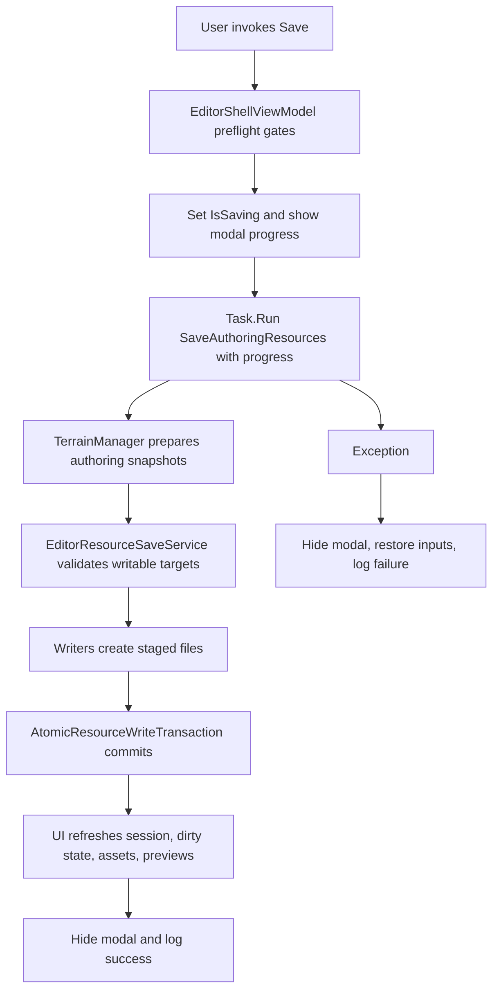

# Editor Save Progress Design

**Date:** 2026-06-15  
**Status:** Approved for planning review  
**Scope:** Terrain Editor authoring Save command

## Problem

`EditorShellViewModel.Save()` currently runs synchronously on the Avalonia UI path. It writes multiple authoring resources, including `heightmap.png` and `biome_mask.png`, through `TerrainManager.SaveAuthoringResources()` and `EditorResourceSaveService.Save()`. Large PNG encoding can make the editor appear frozen. Export already uses a progress-reporting async model, but Save does not.

## Goals

- Show visible modal progress while authoring resources are saving.
- Keep the Avalonia UI responsive enough for progress updates.
- Prevent concurrent edits and repeated Save commands while a save is in progress.
- Preserve existing authoring save semantics:
  - save writes `default.toml`, `heightmap.png`, `biome_mask.png`, `materials/descriptor.toml`, and `biome_settings.toml`;
  - missing heightmap and blocking material ID issues still prevent save before any write;
  - `AtomicResourceWriteTransaction` continues to roll back staged resource writes on failure;
  - dirty state is cleared only after a successful save.

## Non-Goals

- No cancel button in the first implementation. Cancellation during PNG encoding and staged file commit needs a separate rollback contract.
- No row-level PNG progress. The first version reports file-level phases.
- No background editing during save. Save is modal and locks editing commands.
- No change to export progress behavior.

## Recommended Approach

Use an async modal save flow with file-level staged progress.

`SaveCommand` becomes asynchronous. After the existing preflight checks pass, the shell sets save state properties, shows a modal progress surface, and runs the expensive save work off the UI thread. Progress reports are marshalled back to the UI thread through `Progress<T>`. When the background save completes successfully, the shell refreshes resource session state, clears dirty state, refreshes assets and material previews, and logs success. On failure, the shell restores UI state and logs the existing `Save failed: ...` message.

This approach is preferred because it solves the user-visible freeze without widening the save contract into a fully concurrent background-editing system.

## Progress Model

Add a save-specific progress report type named `AuthoringSaveProgress`, instead of reusing `ExportProgress`.

Fields:

- `Current`
- `Total`
- `Message`
- `IsCompleted`
- `ErrorMessage`

Expected phases:

1. Validating save targets
2. Preparing authoring data
3. Writing map definition
4. Writing heightmap PNG
5. Writing biome mask PNG
6. Writing material descriptor
7. Writing biome settings
8. Committing staged resources
9. Refreshing editor state

`TerrainManager.SaveAuthoringResources()` accepts an optional `IProgress<AuthoringSaveProgress>` and reports the high-level preparation phase before calling `EditorResourceSaveService.Save()`. `EditorResourceSaveService.Save()` accepts the same optional progress object and reports validation, each staged writer, and commit. Existing callers can omit progress.

## UI Design

The shell view model exposes save state:

- `IsSaving`
- `SaveProgressCurrent`
- `SaveProgressTotal`
- `SaveProgressPercent`
- `SaveProgressMessage`
- `CanRunMutatingCommand`

`MainWindow.axaml` adds a lightweight modal progress surface bound to `IsSaving`. The surface shows:

- title: `Saving authoring resources`
- current phase message
- progress bar
- percentage text

The editor viewport is hosted through a native HWND, so Avalonia visual content may not reliably cover the Stride viewport. The modal design therefore does not rely on visual occlusion alone. It also disables mutating commands and asks the viewport/game input path to ignore camera and brush input while `IsSaving` is true.

Commands disabled during save include Save, Export Terrain, Undo, Redo, Import Assets, Delete Asset Item, and material import or clear operations. These commands use the shared `CanRunMutatingCommand` gate, and a second `Ctrl+S` during save is ignored rather than queued.

## Data Flow

## Error Handling

Preflight failures continue to return before save state begins. Runtime save failures restore `IsSaving = false`, re-enable commands, and keep dirty state unchanged. Transaction rollback remains owned by `AtomicResourceWriteTransaction`.

If progress reports an error, the shell logs it through the existing console path. The primary failure signal is still the thrown exception, so existing test and console behavior stay consistent.

## Testing

Add focused tests:

- `EditorResourceSaveServiceTests` verifies progress events are emitted in the expected order for a successful save.
- Existing rollback test remains valid and can assert that progress reaches the failing writer before the exception.
- Text-level workflow tests verify:
  - `SaveCommand` uses an async path;
  - shell exposes `IsSaving` and save progress bindings;
  - `MainWindow.axaml` contains the save progress UI;
  - mutating commands are gated while saving.

Run verification:

- `dotnet build Terrain.sln`
- `dotnet run --project Terrain.Editor.Tests/Terrain.Editor.Tests.csproj --no-build`

## Documentation

At session end, add a log under `docs/log/2026/06/15/`. Update `docs/ARCHITECTURE_OVERVIEW.md` and `docs/CURRENT_FEATURES.md` only if the implementation changes the documented editor save behavior. Add a learning only if the native-HWND modal input-lock pattern proves reusable or surprising during implementation.
