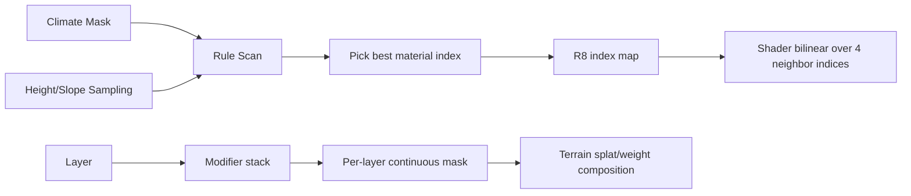

## 问题与范围

问题：当前仓库里的 gradient texturing 为什么容易做出“规则感很强但不好调、过渡也不够自然”的结果？  
范围：只看当前自动贴图链路和 `E:\UnityProjects\My project (1)\Assets\ProceduralTerrainPainter` 参考实现，不扩展到别的地形系统。

## 速答

当前实现的核心问题不是“平滑函数不够好”，而是数据表达从一开始就被压扁了：

1. 当前自动贴图只根据 `climate + altitude + slope` 对每个 texel 算一个 `bestWeight`，然后直接选出唯一赢家材质写入单通道 index map，导致规则之间不能真正叠加，也没有保留连续权重。
2. shader 端虽然会对四邻域 index 做双线性混合，但这只是对“离散赢家结果”做插值，不是对真实材质权重做混合，所以能软化边缘网格感，不能提供 ProceduralTerrainPainter 那种层层塑形的质感。
3. 当前规则系统还把同气候下的 altitude/slope 区间做了串联归一化，规则间天然互相绑定，导致可控性比参考实现的 per-layer modifier stack 弱很多。
4. ProceduralTerrainPainter 真正值得借鉴的不是某一个 Height/Slope 算法，而是“每个材质层独立生成 mask，再用 modifier stack 叠加”的 authoring 模型。

## 关键证据

1. 当前 compute 只输出单通道 index map，并在循环中按最大权重选唯一材质，见 [EditorTerrainBuildSplatMap.sdsl](E:/Stride Projects/Terrain/Terrain.Editor/Effects/EditorTerrainBuildSplatMap.sdsl:136) 到 [EditorTerrainBuildSplatMap.sdsl](E:/Stride Projects/Terrain/Terrain.Editor/Effects/EditorTerrainBuildSplatMap.sdsl:150)。
2. `EncodeMaterialPixel` 接收了 `materialWeight` 参数，但实际完全丢弃，只编码 `materialIndex`，见 [EditorTerrainBuildSplatMap.sdsl](E:/Stride Projects/Terrain/Terrain.Editor/Effects/EditorTerrainBuildSplatMap.sdsl:114)。
3. 当前规则模型只有 `ClimateId + Min/MaxAltitude + Min/MaxSlopeDegrees + BlendRange + MaterialSlotIndex`，表达能力本质上是“二维区间过滤器”，见 [ClimateRuleService.cs](E:/Stride Projects/Terrain/Terrain.Editor/Services/ClimateRuleService.cs:17)。
4. 同气候规则会被 `NormalizeClimateRanges` 强制串联，后一个 rule 的 `MinAltitude/MinSlopeDegrees` 直接继承前一个 rule 的 `Max...`，见 [ClimateRuleService.cs](E:/Stride Projects/Terrain/Terrain.Editor/Services/ClimateRuleService.cs:351)。
5. 当前 editor/runtime shader 的材质混合，都是读取四个邻居 texel 的离散材质索引后再做双线性混色，见 [EditorTerrainDiffuse.sdsl](E:/Stride Projects/Terrain/Terrain.Editor/Effects/EditorTerrainDiffuse.sdsl:170) 和 [MaterialTerrainDiffuse.sdsl](E:/Stride Projects/Terrain/Terrain/Effects/Material/MaterialTerrainDiffuse.sdsl:138)。
6. 参考实现的最小 authoring 单位是 `LayerSettings + modifierStack`，每层独立执行一串 modifier，而不是全局 rule 竞争，见 [LayerSettings.cs](E:/UnityProjects/My project (1)/Assets/ProceduralTerrainPainter/Runtime/LayerSettings.cs:10) 和 [ModifierStack.cs](E:/UnityProjects/My project (1)/Assets/ProceduralTerrainPainter/Runtime/ModifierStack.cs:84)。
7. 参考实现的 modifier 不只有 height/slope，还支持 curvature、direction、noise、texture mask，并且每个 modifier 有 blend mode 和 opacity，可连续叠加，见 [Modifier.cs](E:/UnityProjects/My project (1)/Assets/ProceduralTerrainPainter/Runtime/Modifiers/Modifier.cs:32) 与 [Filters.hlsl](E:/UnityProjects/My project (1)/Assets/ProceduralTerrainPainter/Shaders/Filters.hlsl:15)。

## 细节展开

### 当前实现的问题不在 shader 插值，而在 authoring 数据过早离散化

当前链路是：

- `TerrainManager` 创建 1:1 的 `ClimateMask` 和 `MaterialIndexMap`，见 [TerrainManager.cs](E:/Stride Projects/Terrain/Terrain.Editor/Services/TerrainManager.cs:167)。
- `EditorTerrainSplatMapComputeDispatcher` 在 climate mask / climate rules 脏时重建每个 slice 的 `OutputIndexMap`，见 [EditorTerrainSplatMapComputeDispatcher.cs](E:/Stride Projects/Terrain/Terrain.Editor/Rendering/EditorTerrainSplatMapComputeDispatcher.cs:35)。
- compute shader 根据 altitude/slope 算 rule weight，但最后只保留最大者。

这意味着：

- 你没有“草地 0.6 + 泥土 0.4”这种状态；
- 只有“这个 texel 是草地，邻居可能是泥土”；
- shader 中的平滑本质上只是对邻格赢家做插值。

所以如果你不满意的是生态带分布太机械、局部变化不自然、规则间抢边界，那继续微调 `BlendRange` 收益会很有限。

### 当前 rule 设计把很多本该独立的维度耦合了

`NormalizeClimateRanges` 同时串联 altitude 和 slope 两套区间，这会带来两个副作用：

- 新增一条 rule 往往会改掉已有 rule 的有效区间；
- altitude 分层和 slope 分层不能独立思考，只能被迫排成同一个序列。

这和参考实现差别很大。参考实现里，一个 layer 可以先做 height，再叠一层 noise，再乘 slope，再加 direction，逻辑是可组合的，不是一个扁平区间表。

### ProceduralTerrainPainter 的关键价值是“连续 mask authoring”

参考实现不是在求“哪个 layer 赢”，而是在求“每个 layer 的 mask 长什么样”。  
`ModifierStack.ProcessSingleLayer` 会先生成白底，再按顺序叠 modifier，最后把这一层结果写回 terrain layer。这样每个 layer 都有自己的连续 alpha 形成过程。

这类模型的优势是：

- 可以先做大形体，再用噪声破边；
- 可以独立控制不同 layer 的生成逻辑；
- 更容易做出“看起来像自然形成”的破碎边界和局部斑驳。

## 未决问题

1. 运行时是否必须继续坚持单通道 `R8` index map 作为最终格式。
2. 当前项目能接受的额外显存/带宽预算是多少。
3. 你更在意的是“自动生成质量”，还是“编辑器里规则 authoring 的可控性”。

## 后续建议

如果要继续做这块，优先把“单赢家 rule 表”升级成“per-material mask stack”，再决定最终是保留 R8 索引落地，还是升级为真正的权重贴图格式。

## 相关文档

- [terrain-texture-brush-planning.md](E:/Stride Projects/Terrain/docs/log/2026/04/06/2026-04-06-2-terrain-texture-brush-planning.md)
- [terrain-texture-brush-implementation.md](E:/Stride Projects/Terrain/docs/log/2026/04/06/2026-04-06-3-terrain-texture-brush-implementation.md)
