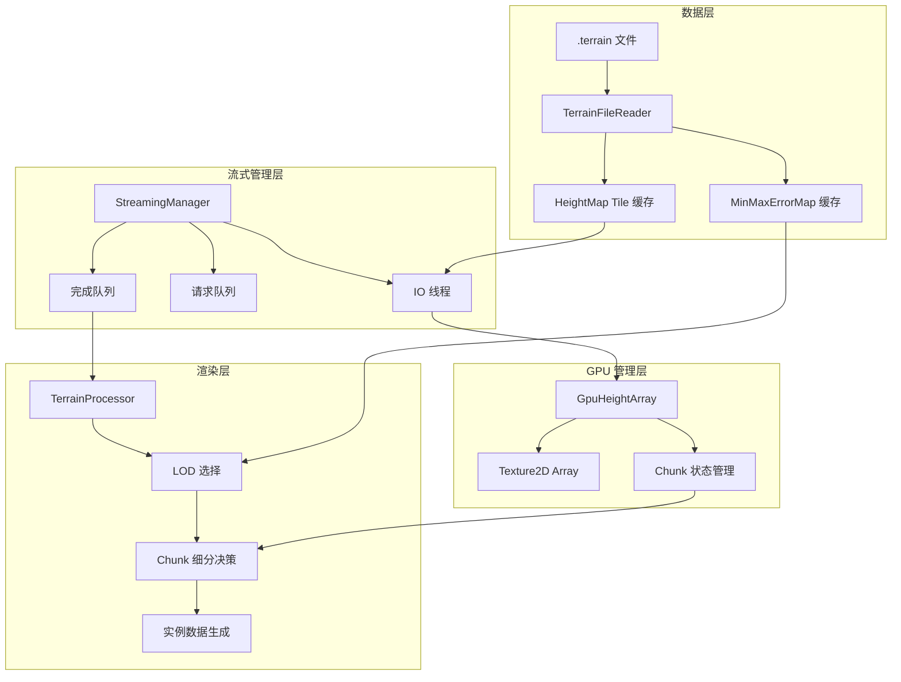
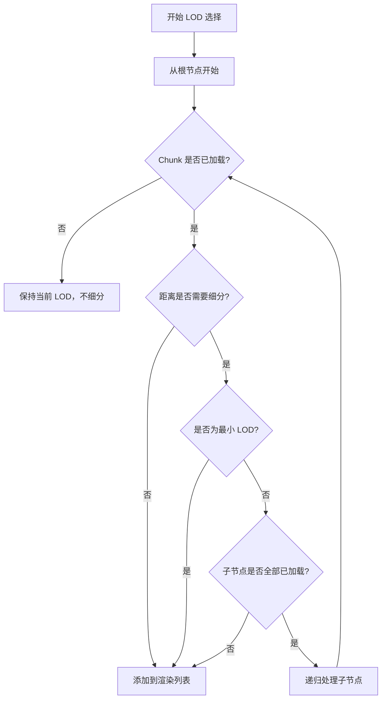
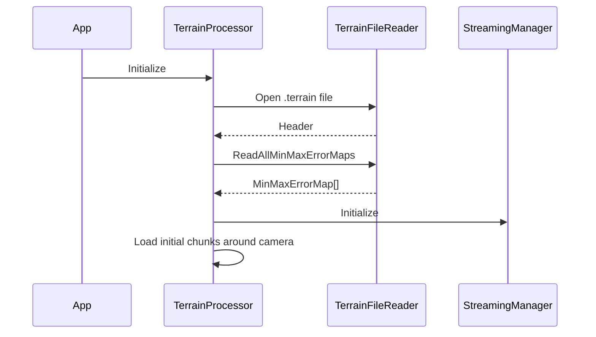
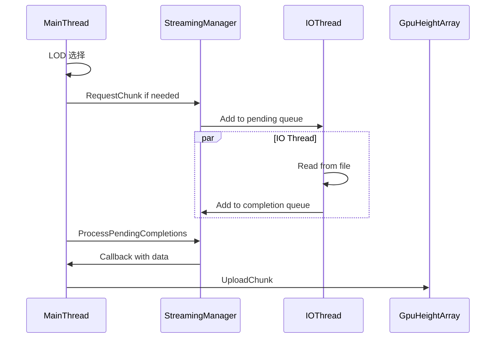

# 地形流式加载设计方案

## 1. 概述

### 1.1 目标
为地形系统实现流式加载功能，支持超大地形场景，在保持渲染质量的同时降低内存占用和加载时间。

### 1.2 设计原则
- **Texture2D Array**：使用 Texture2D Array 存储高度图 chunks，避免 Atlas UV 计算复杂性
- **按需细分**：未加载完成的 chunk 不细分，保持低 LOD 渲染
- **预计算复用**：直接使用预处理工具生成的 MinMaxErrorMap，避免运行时重复计算
- **渐进加载**：后台异步加载，不影响主线程帧率

### 1.3 参考实现
基于 `StrideStreamingTerrain` 项目的流式加载架构，适配当前项目的 LOD 选择机制。

---

## 2. 数据格式分析

### 2.1 预处理工具输出格式 (`.terrain` 文件)

```
┌─────────────────────────────────────┐
│         TerrainFileHeader           │  文件头 (68 bytes)
├─────────────────────────────────────┤
│         MinMaxErrorMap[]            │  预计算的 LOD 选择数据
│  ┌───────────────────────────────┐  │
│  │ LOD 0: [width × height × 3]   │  │  float[]: min, max, error
│  │ LOD 1: ...                    │  │
│  │ ...                           │  │
│  │ LOD N: ...                    │  │
│  └───────────────────────────────┘  │
├─────────────────────────────────────┤
│         HeightMap SVT Data          │  高度图虚拟纹理数据
│  ┌───────────────────────────────┐  │
│  │ VTHeader                      │  │
│  │ Mip 0 tiles...                │  │
│  │ Mip 1 tiles...                │  │
│  │ ...                           │  │
│  └───────────────────────────────┘  │
├─────────────────────────────────────┤
│         SplatMap SVT Data           │  可选：混合贴图数据
└─────────────────────────────────────┘
```

### 2.2 关键数据结构

#### TerrainFileHeader
```csharp
public struct TerrainFileHeader
{
    public int Magic;           // "TERR"
    public int Version;
    public int Width, Height;   // 地形尺寸
    public int LeafNodeSize;    // 叶子节点尺寸 (16/32/64)
    public int TileSize;        // SVT Tile 尺寸 (129/257/513)
    public int Padding;         // 边缘填充 (2)
    public int HeightMapMipLevels;
    public int HasSplatMap;
    public int SplatMapFormat;
    public int SplatMapMipLevels;
    // Reserved fields...
}
```

#### MinMaxErrorMap
```csharp
// 每个 chunk 存储三个值
float min;    // 该区域最小高度
float max;    // 该区域最大高度
float error;  // 几何误差（用于 LOD 选择）
```

---

## 3. 架构设计

### 3.1 系统架构图



### 3.2 核心组件

#### 3.2.1 TerrainFileReader
负责解析 `.terrain` 文件格式，提供随机访问能力。

```csharp
public class TerrainFileReader : IDisposable
{
    private readonly Stream _stream;
    private readonly BinaryReader _reader;
    private readonly TerrainFileHeader _header;
    private readonly long _minMaxErrorMapOffset;
    private readonly long _heightMapSvtOffset;
    
    public TerrainFileHeader Header => _header;
    
    // 读取指定 LOD 层级的 MinMaxErrorMap
    public MinMaxErrorMap ReadMinMaxErrorMap(int lodLevel);
    
    // 读取指定 chunk 的高度数据
    public byte[] ReadHeightMapTile(int mipLevel, int tileX, int tileY);
    
    // 读取所有 MinMaxErrorMap（初始化时调用）
    public MinMaxErrorMap[] ReadAllMinMaxErrorMaps();
}
```

#### 3.2.2 StreamingManager
后台 IO 线程管理，异步加载地形数据。

```csharp
public class StreamingManager : IDisposable
{
    private readonly Thread _ioThread;
    private readonly BlockingCollection<StreamingRequest> _pendingRequests;
    private readonly ConcurrentQueue<StreamingRequest> _completionQueue;
    
    // 请求加载 chunk 数据
    public void RequestChunk(int chunkIndex, StreamingCallback callback);
    
    // 主线程每帧调用，处理完成的请求
    public void ProcessPendingCompletions(int maxTimeMs = -1);
    
    // 后台线程入口
    private void StreamingThread();
}
```

#### 3.2.3 GpuHeightArray
管理 GPU 端的高度图 Texture2D Array。

```csharp
public class GpuHeightArray : IDisposable
{
    // Texture2D Array: 每个元素是一个 chunk 的高度图
    // 格式: R16_UNorm, 尺寸: (tileSize+padding*2) x (tileSize+padding*2)
    private readonly Texture _heightArray;
    
    // chunkIndex -> arrayIndex 映射
    private readonly Dictionary<int, int> _chunkToArrayIndex;
    
    // 空闲的 array 索引
    private readonly Queue<int> _freeArrayIndices;
    
    // 每个 array 槽位的状态
    private readonly ChunkSlotState[] _slotStates;
    
    // 检查 chunk 是否已加载
    public bool IsChunkResident(int chunkIndex);
    
    // 请求加载 chunk（返回 false 表示需要等待加载）
    public bool RequestChunk(int chunkIndex);
    
    // 上传 chunk 数据到 Texture2D Array 的指定层
    public void UploadChunk(CommandList commandList, int chunkIndex, byte[] data);
    
    // 获取 chunk 在 array 中的索引（用于 shader 采样）
    public int GetChunkArrayIndex(int chunkIndex);
    
    // 释放长时间未使用的 chunk
    public void EvictInactiveChunks(int frameThreshold);
}
```

**Texture2D Array 优势：**
- 无需计算 Atlas UV 偏移，直接使用 array index 采样
- 每个 chunk 独立，无边界问题
- 支持不同 LOD 层级的 chunk 混合存储
- Shader 采样更简单：`HeightArray.SampleLevel(sampler, float3(uv, arrayIndex), 0)`

#### 3.2.4 TerrainStreamingData
运行时地形数据容器。

```csharp
public class TerrainStreamingData
{
    public TerrainFileReader FileReader;
    public StreamingManager StreamingManager;
    public GpuHeightArray HeightArray;
    public MinMaxErrorMap[] MinMaxErrorMaps;
    
    public int MaxLod;
    public int ChunksPerRowLod0;
    public float UnitsPerTexel;
}
```

---

## 4. LOD 选择与流式加载集成

### 4.1 LOD 选择流程



### 4.2 关键修改点

#### TerrainProcessor.cs 修改

```csharp
// 当前实现：运行时计算 MinMaxErrorMap
private bool TryLoadTerrainData(...)
{
    // 从 Texture 读取高度图
    // 运行时计算 MinMaxErrorMap
}

// 新实现：从 .terrain 文件加载预计算数据
private bool TryLoadStreamingTerrainData(...)
{
    // 1. 读取 TerrainFileHeader
    // 2. 直接加载预计算的 MinMaxErrorMap[]
    // 3. 初始化 StreamingManager 和 GpuHeightArray
}
```

#### LOD 选择逻辑修改

```csharp
// 当前实现：GPU Compute Shader 选择
// 新实现：CPU 选择 + 流式加载状态检查

private void SelectChunksForRendering(Vector3 cameraPosition)
{
    var stack = new Stack<ChunkInfo>();
    stack.Push(rootChunk);
    
    while (stack.Count > 0)
    {
        var chunk = stack.Pop();
        
        // 关键：检查 chunk 是否已加载
        if (!_streamingData.HeightArray.IsChunkResident(chunk.Index))
        {
            // 未加载完成，保持当前 LOD，不细分
            AddToRenderList(chunk);
            continue;
        }
        
        // 计算屏幕空间误差
        var error = CalculateScreenSpaceError(chunk, cameraPosition);
        
        if (error > _maxScreenSpaceError && chunk.LodLevel > 0)
        {
            // 检查子节点是否全部已加载
            bool allChildrenResident = CheckChildrenResident(chunk);
            
            if (allChildrenResident)
            {
                // 细分
                foreach (var child in chunk.Children)
                    stack.Push(child);
            }
            else
            {
                // 子节点未完全加载，保持当前 LOD
                AddToRenderList(chunk);
            }
        }
        else
        {
            AddToRenderList(chunk);
        }
    }
}
```

---

## 5. 数据加载策略

### 5.1 初始化加载



### 5.2 运行时流式加载



### 5.3 优先级策略

1. **相机周围优先**：距离相机近的 chunk 优先加载
2. **父节点优先**：低 LOD 的 chunk 优先加载（保证基础地形可见）
3. **时间预算**：每帧限制加载时间，避免卡顿

---

## 6. GPU 资源管理

### 6.1 Texture2D Array 结构

```
Texture2D Array (R16_UNorm)
┌─────────────────────────────────────┐
│  Layer 0: Chunk 0   (133x133)       │  每个 Chunk 包含 padding
│  Layer 1: Chunk 1   (133x133)       │  tileSize=129 + padding=2
│  Layer 2: Chunk 2   (133x133)       │
│  ...                                │  最大 1024 层
│  Layer N: Chunk N   (133x133)       │
└─────────────────────────────────────┘

创建方式：
Texture.New2DArray(graphicsDevice,
    width: tileSize + padding * 2,    // 133
    height: tileSize + padding * 2,   // 133
    mipCount: 1,
    format: PixelFormat.R16_UNorm,
    arraySize: maxChunks,             // 1024
    flags: TextureFlags.ShaderResource);
```

### 6.2 Shader 修改

需要修改 [`MaterialTerrainDisplacement.sdsl`](Terrain/Effects/MaterialTerrainDisplacement.sdsl) 以支持从 Texture2D Array 采样：

```hlsl
// 当前实现：直接从完整高度图采样
rgroup PerMaterial
{
    stage Texture2D<float> HeightTexture;
    stage StructuredBuffer<int4> InstanceBuffer;
}

// 新实现：从 Texture2D Array 采样
rgroup PerMaterial
{
    stage Texture2DArray<float> HeightArray;  // 改为 Texture2DArray
    stage StructuredBuffer<int4> InstanceBuffer;
}

// InstanceBuffer 扩展：增加 arrayIndex
// int4: (chunkX, chunkY, lodLevel, arrayIndex | neighborMaskPacked)

// 采样方式
float height = HeightArray.SampleLevel(LinearSampler, float3(uv, arrayIndex), 0).x;
```

### 6.3 Instance Data 结构修改

```csharp
// 当前实现
Int4: (chunkX, chunkY, lodLevel, neighborMask)

// 新实现：需要传递 arrayIndex
// 方案 A: 扩展为 Int2 或使用更多字段
Int4: (chunkX, chunkY, lodLevel, arrayIndex)  // neighborMask 通过其他方式传递

// 方案 B: 打包 arrayIndex 和 neighborMask
// neighborMask 只需要 32 位，arrayIndex 最多需要 10-12 位
// 可以打包为：arrayIndex (低 12 位) | neighborMask (高 20 位)
int packedData = arrayIndex | (neighborMask << 12);
Int4: (chunkX, chunkY, lodLevel, packedData)
```

---

## 7. 实现计划

### Phase 1: 数据加载基础设施
- [ ] 实现 `TerrainFileReader` 类
- [ ] 实现 `MinMaxErrorMap` 二进制读取
- [ ] 添加 `.terrain` 文件格式验证

### Phase 2: 流式加载系统
- [ ] 实现 `StreamingManager` 后台线程
- [ ] 实现请求队列和完成队列
- [ ] 实现加载优先级策略

### Phase 3: GPU Texture2D Array 管理
- [ ] 实现 `GpuHeightArray` Texture2D Array 管理
- [ ] 实现 chunk 槽位分配和释放
- [ ] 实现 LRU 淘汰策略

### Phase 4: LOD 选择集成
- [ ] 修改 `TerrainProcessor` 使用预计算 MinMaxErrorMap
- [ ] 实现 CPU 端 LOD 选择逻辑
- [ ] 集成流式加载状态检查

### Phase 5: Shader 适配
- [ ] 修改 displacement shader 支持 Texture2D Array 采样
- [ ] 添加 arrayIndex 参数传递
- [ ] 测试渲染正确性

### Phase 6: 优化与测试
- [ ] 性能分析和优化
- [ ] 内存使用优化
- [ ] 边界情况测试

---

## 8. 配置参数

### 8.1 TerrainComponent 新增属性

```csharp
[DataMember(100)]
public string? TerrainDataPath { get; set; }  // .terrain 文件路径

[DataMember(110)]
public int MaxArrayLayers { get; set; } = 1024;  // Texture2D Array 最大层数

[DataMember(120)]
public int MaxResidentChunks { get; set; } = 1024;  // 最大驻留 chunk 数

[DataMember(130)]
public int ChunkEvictionFrameThreshold { get; set; } = 300;  // chunk 淘汰帧数阈值

[DataMember(140)]
public int StreamingBudgetPerFrameMs { get; set; } = 2;  // 每帧流式加载时间预算
```

### 8.2 调试选项

```csharp
[DataMember(200)]
public bool DebugShowChunkBounds { get; set; }  // 显示 chunk 边界

[DataMember(210)]
public bool DebugShowLodLevels { get; set; }  // 显示 LOD 层级颜色

[DataMember(220)]
public bool DebugShowStreamingStatus { get; set; }  // 显示流式加载状态
```

---

## 9. 兼容性考虑

### 9.1 向后兼容
- 保留现有的 `HeightmapTexture` 属性，支持传统加载方式
- 如果 `TerrainDataPath` 为空，回退到原有实现

### 9.2 编辑器支持
- 编辑器模式下使用 `EditorTerrainDataProvider`
- 支持编辑器预览和调试

---

## 10. 风险与缓解

| 风险 | 影响 | 缓解措施 |
|------|------|----------|
| Atlas 空间不足 | 渲染异常 | 动态淘汰 + 空间预警 |
| 加载延迟导致 LOD 跳变 | 视觉闪烁 | 渐进式 LOD 过渡 |
| 线程同步问题 | 崩溃 | 严格的线程安全设计 |
| 文件格式变更 | 兼容性问题 | 版本检查 + 向后兼容 |

---

## 11. 总结

本方案采用简化的流式加载策略：
1. **高度图完整加载到 GPU**（不使用完整 SVT）
2. **预计算 MinMaxErrorMap 直接加载**（避免运行时计算）
3. **未加载完成的 chunk 不细分**（保持低 LOD 渲染）

这种方案在保持渲染质量的同时，显著降低了初始化时间和内存占用，适合中大型地形场景。
